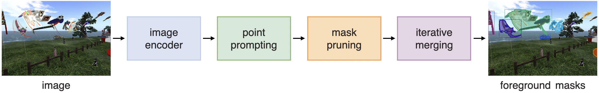

# [ECCV'24] ProMerge: Prompt and Merge for Unsupervised Instance Segmentation

**ProMerge** is a fundamental improvement over prior leading approaches to unsupervised instance segmentation and object detection. For the challenging SA1B benchmark, we observe a 41.8% improvement in AP and 20.6% improvement in AR compared to the CutLER SOTA. We observe increases in AR and AP across six benchmarks with the pseudolabel generation process and the downstream trained class agnostic detector. 


Official PyTorch implementation for ProMerge (ECCV'24). Details can be found in the paper.


> ProMerge: Prompt and Merge for Unsupervised Instance Segmentation \
> Dylan Li, [Gyungin Shin](https://www.robots.ox.ac.uk/~gyungin/) \
> [Meta Reality Labs](https://about.meta.com/realitylabs/), [Oxford Visual Geometry Group](https://www.robots.ox.ac.uk/~vgg/) \
> [[`paper`](https://arxiv.org/pdf/2409.18961)], [[`project page`](https://www.robots.ox.ac.uk/~vgg/research/promerge/)]

## Features
- Prior leading unsupervised methods rely on repeatedly solving graph partitioning over the global context of the image in feature space. These methods miss smaller objects that are primarily local in context.
- We propose ProMerge (and the downstream ProMerge+), which generates a large number of masks per image by obviating the resolution of the generalized eigevalue problem. ProMerge lifts precision/recall on diverse datasets while reducing pseudolabel generation time. 
- We use the [CutLER](https://github.com/facebookresearch/CutLER?tab=readme-ov-file) training recipe for a single round and show that training a MaskRCNN detector on the high-quality ProMerge pseudo-labels results in SOTA performance on six diverse benchmarks. AP results below ProMerge/Promerge+ and its attendant performance gains relative to CutLER/MaskCut. 

|           | COCO2017 | COCO20K | LVIS  | KITTI | Objects365 | SA-1B |
|    --     |    --    |   --    |  --   |   --  |     --     |   --  |
| MaskCut [training-free]   |    2.2   |   3.0   |  0.9  |  0.2  |    1.7     |  0.8  |
| ProMerge [training-free]  |    2.4   |   3.0   |  1.3  |  0.3  |    2.2     |  1.2  |
| CutLER    |    8.7   |   8.9   |  3.4  |  3.9  |   11.5     |  5.5  | 
| ProMerge+ |    8.9   |   9.0   |  4.0  |  5.4  |   12.2     |  7.8  |

- ProMerge relies on a relatively simple procedure of prompting and merging masks. A brief procedural diagram is shown below. 



## Demo
To be updated.

## Inference
Please download datasets and their annotation files:
- [COCO2017](http://images.cocodataset.org/zips/val2017.zip) [[`annotation file`](http://dl.fbaipublicfiles.com/cutler/coco/coco_cls_agnostic_instances_val2017.json)]
- [COCO-20K](https://cocodataset.org/#download) [[`annotation file`](http://dl.fbaipublicfiles.com/cutler/coco/coco20k_trainval_gt.json)]
- [LVIS](http://images.cocodataset.org/zips/val2017.zip) [[`annotation file`](http://dl.fbaipublicfiles.com/cutler/coco/lvis1.0_cocofied_val_cls_agnostic.json)]
- [KITTI](https://www.cvlibs.net/datasets/kitti/eval_step.php) [[`annotation file`](https://dl.fbaipublicfiles.com/cutler/kitti/trainval_cls_agnostic.json)]
- [Objects365](https://www.objects365.org/download.html) [[`annotation file`](https://www.robots.ox.ac.uk/~vgg/research/promerge/shared_files/objects365_16-40.json)]
- [SA-1B](https://scontent-lhr8-1.xx.fbcdn.net/m1/v/t6/An_-m2SWozW4o-FatJEIY1Anj32x8TnUqad9WMAVkMaZHkDyHfjpLcVlQoTFhgQihg8U4R5KqJvoJrtBwT3eKH-Yj5-LfY0.tar?ccb=10-5&oh=00_AYA9kGsV-zzziVDpf8ErkuQzkQ4GW2nYfw8RsFN9aosqhg&oe=66F7EB7E&_nc_sid=0fdd51) [[`annotation file`](https://www.robots.ox.ac.uk/~vgg/research/promerge/shared_files/sa1b.json)]

<!-- Note that KITTI and Objects365 require you to sign up to download the data. -->

## Result files
To be uploaded.

<!--
We provide predictions for each dataset as follows.
#### ProMerge
| dataset  | AP | AR |
|----------|----|----|
| COCO2017 | 2.2|    |
| COCO-20K | 3.0|    |
| LVIS     |    |    |
| KITTI    |    |    |
| SA-1B    |    |    |

#### ProMerge+
| dataset  | AP | AR |
|----------|----|----|
| COCO2017 |    |    |
| COCO-20K |    |    |
| LVIS     |    |    |
| KITTI    |    |    |
| SA-1B    |    |    |

-->

## License 
The majority of ProMerge, Detectron2 and DINO are licensed under the CC-BY-NC license. However portions of the project are available under separate license terms. CRF is licensed under the MIT license. If you later add other third party code, please keep this license info updated, and please let us know if that component is licensed under something other than CC-BY-NC, MIT, or CC0.

## Citation
```
@inproceedings{li2024promerge,
  title = {ProMerge: Prompt and Merge for Unsupervised Instance Segmentation},
  author = {Li, Dylan and Shin, Gyungin},
  booktitle = {European Conference on Computer Vision (ECCV)},
  year = {2024}
}
```

### Questions
If you have any questions about our code/implementation, please contact us at gyungin [at] robots [dot] ox [dot] ac [dot] uk.
